# Awesome-Cloud-Migration-Tracking-Orchestration 🗺️ ⚙️ 🚀

  

  
  
  
  
  
  

---

## 🌟 Top Cloud Migration Tracking & Orchestration Ecosystem ☁️ 🛠️

**Curated List of Commercial Migration Orchestration Platforms & Open-Source Tracking Frameworks**  
*Focused on Workflow Automation, Wave Planning, Migration Progress Tracking, Dependency Validation & Self-Hosted Orchestration Engines* 📊

**Last updated: October 2026** 📅

---

### 📌 Overview & SEO Summary 🔍

Welcome to the definitive curated directory of **cloud migration tracking and orchestration platforms**, **open-source migration workflow engines**, and **wave planning frameworks**. Whether your enterprise is seeking hyperscaler-native governance tools (such as *Azure Migrate*, *Google Cloud Migration Center*, and *AWS Transform*), enterprise multi-cloud platforms (like *Flexera One*, *Device42*, and *Tidal Cloud*), or self-hostable open-source orchestration suites (like *Cloud-Barista Cloud-Migrator*, *Konveyor Move2Kube*, *Prophet*, and *Cloud Migration MCP*), this comprehensive guide delivers structured evaluations, verified pricing models, and open-source project metrics.

**Key Market Insights:** 💡

- **AWS Migration Hub transitioned new customer onboardings to AWS Transform on November 7, 2025** — **AWS Transform** provides advanced AI-driven workload refactoring, automated code conversion, and migration wave orchestration.
- **Azure Migrate remains completely free** for discovery, inventory assessment, and wave planning, with integrated **Azure Copilot migration agent** providing conversational wave architecture.
- **Enterprise ROI Impact:** Tools like **Tidal Cloud** and **Cloudamize** routinely reduce migration planning cycles from **4 months down to 6 weeks**, yielding up to **48% cost savings** during workload migration waves.

---

## 📑 Table of Contents 📋

- [📈 Market Size & Industry Dynamics](#-market-size--industry-dynamics)
- [🏢 SaaS & Commercial Platforms](#-saas--commercial-platforms)
- [🔓 Open-Source GitHub Projects](#-open-source-github-projects)
- [🛠️ How to Contribute](#%EF%B8%8F-how-to-contribute)
- [📊 Star History](#-star-history)
- [🤝 Support & Sponsorship](#-support--sponsorship)
- [⚠️ Disclaimer](#%EF%B8%8F-disclaimer)

---

## 📈 Market Size & Industry Dynamics 📊

The global cloud migration services and orchestration market size is estimated at **$185 Billion – $323 Billion** (with broader cloud transformation services exceeding $400 Billion), expanding at a rapid **CAGR of 16.8% to 27.7%**. The sector exhibits a **moderately fragmented market structure**: while top hyperscalers (Microsoft Azure, AWS, Google Cloud) and global IT consulting firms command nearly **46% of total market revenue**, specialized software vendors (ISVs) and open-source tools actively capture significant market share by addressing complex application dependency mapping, sovereign compliance, cross-cloud refactoring, and agentic AI migration planning.

---

## 🏢 SaaS / Commercial Platforms 💼

The SaaS and commercial cloud migration tracking ecosystem spans native cloud provider hubs and third-party enterprise platforms. *Sorted by Valuation / Market Capitalization (Descending)* 🔽

| SaaS / Commercial Platform | Company / Owner | Valuation / Market Cap 💰 | Standard Edition Starting Price 🏷️ | Free Tier / Free Trial Limits 🎁 | Description 📝 |
| :--- | :--- | :--- | :--- | :--- | :--- |
| **[Azure Migrate](https://azure.microsoft.com/en-us/products/azure-migrate/)** 🔷 | Microsoft | ~$3.90 Trillion | **Free service** (pay only for consumed Azure compute/storage) | **Free forever** (unlimited discovery, assessment, and wave planning) | **Azure-native migration hub** — **Unified tracking platform** for physical servers, VMs, databases, web apps, and virtual desktops . **Azure Copilot migration agent** for natural language planning. **Agentless dependency mapping**. |
| **[AWS Migration Hub](https://aws.amazon.com/migration-hub/)** ☁️ | Amazon | ~$2.0 Trillion | **Free service** (pay for underlying target AWS infrastructure) | **No new customers after Nov 7, 2025** (existing users retain access; new users directed to AWS Transform) | **AWS-native migration tracking** — **Centralized hub to track progress** across AWS Application Migration Service and DMS . **Migration Hub Orchestrator** supplies **predefined workflow templates** . Replaced by **AWS Transform**. |
| **[Google Cloud Migration Center](https://cloud.google.com/migration-center)** 🌐 | Google (Alphabet) | ~$2.0 Trillion | **Free assessment engine** (pay for deployed GCP resources) | **$300 free credits** (plus free agentless StratoZone discovery) | **GCP-native migration planning** — **End-to-end asset discovery** with automated TCO modeling . **StratoZone** agentless discovery . **1:1 asset cost comparison** via RVTools & ServiceNow imports . |
| **[Cloudamize](https://www.cloudamize.com/)** 📈 | Accenture | ~$200 Billion | **$3,000 / assessment contract** (custom per-node license-month tiers) | **Free guided demo** (no self-serve free trial) | **AI-augmented migration planning** — **Application-Based Move Groups** for automated wave planning . **1,000+ enterprise migrations** executed with **70-80% planning time reduction** and **48% average cost savings** . |
| **[Turbonomic](https://www.ibm.com/products/turbonomic)** ⚙️ | IBM | ~$200 Billion | **$50,760 / year** (base tier covering 200 managed virtual servers) | **30-day full-featured free trial** | **Application resource management** — **Migration wave simulation** comparing Lift & Shift vs. Optimized target topologies . **What-if capacity planning** and continuous automated post-migration right-sizing . |
| **[Flexera One Cloud Migration](https://www.flexera.com/)** 📊 | Flexera (Thoma Bravo) | ~$2.9 Billion | **$25,000 / year** (enterprise multi-cloud assessment package) | **Request-based demo** (no self-serve free trial) | **Multi-cloud migration planning** — **Workload placement engine** with multi-cloud cost modeling . **Application dependency mapping** evaluating business service impact . |
| **[Device42](https://www.device42.com/)** 🔍 | Device42 | ~$250 Million | **$1,449 / year** (Tier 1 starting package for 1-100 devices) | **14-day full-featured free trial** | **Discovery and dependency mapping** — **Agentless autodiscovery** with real-time application dependency visualization . **What-If migration scenario modeling** and cloud sizing recommendations . |
| **[CAST Highlight](https://www.castsoftware.com/)** 🎯 | CAST Software | ~$150 Million | **$6,800 / year** (Complete Insights per single application) | **14-day free trial** (portfolio sample scanning) | **Software intelligence for cloud migration** — **Source code scanner** identifying cloud blockers, 5R disposition strategies, open-source compliance risks, and remediation effort estimates . |
| **[Riverbed SteelCentral](https://www.riverbed.com/)** 🌊 | Riverbed Technology | ~$100 Million | **$10,000 / year** (starter network visibility module) | **Request-based guided demo** (no self-serve free trial) | **Network performance & migration readiness** — **SteelCentral Controller** providing network path mapping, latency analysis, and network packet dependency validation for migration waves . |
| **[Tidal Cloud](https://www.tidalcloud.com/)** 🌊 | Tidal | ~$50 Million | **$30,000 / year** (Tidal Accelerator Pilot package for up to 60 apps) | **14-day free trial** (plus free Tidal Tools CLI) | **Integrated migration suite** — **Calculator** (business case), **Accelerator** (assessment & wave planning), **LightMesh** (IPAM), and **Saver** (cost optimization) . **Reduces planning time from 4 months to 6 weeks** . |

---

## 🔓 Open-Source GitHub Projects 🐙

Open-source migration workflow engines, resource collection tools, and assessment protocol servers. *Sorted by GitHub_Stars_Count (Descending)* 🌟

- **[konveyor/move2kube](https://github.com/konveyor/move2kube)**  🌟  
  **Automated migration & re-platforming tool for Kubernetes**, open-source. **414 stars** . Analyzes legacy application source code, Dockerfiles, and Swarm configs to automatically generate Kubernetes manifests, Helm charts, and Tekton pipelines for cloud-native deployment waves . 🐳

- **[Azure/migration](https://github.com/Azure/migration)**  🌟  
  **Microsoft Azure Migration Execution Guide & Tracking Framework**, open-source. **194 stars** . Comprehensive open-source framework by FastTrack for Azure engineering teams containing wave planning templates, RACI matrices, discovery checklists, and risk tracking frameworks . 📘

- **[konveyor/kai](https://github.com/konveyor/kai)**  🌟  
  **Konveyor AI Application Modernization & Migration Assistant**, open-source. **85 stars** . AI-powered migration assistant that leverages generative models and static analysis to automate code refactoring, cloud API modernization, and migration blocker remediation . 🤖

- **[konveyor/tackle](https://github.com/konveyor/tackle)**  🌟  
  **Application portfolio assessment and migration engine**, open-source. **44 stars** . Provides business application assessment, dependency analysis, and 5R migration strategy categorization for large-scale enterprise application portfolios . 🎯

- **[Cloud-Migrator (Cloud-Barista)](https://github.com/cloud-barista/cloud-migrator)**  🌟  
  **Integrated multi-cloud migration orchestration platform**, open-source. **35 stars** . Comprehensive 10-subsystem framework featuring **CM-Honeybee** (asset collection), **CM-Ant** (cost/performance evaluation), **CM-Cicada** (workflow management), **CM-Beetle** (infra migration), **CM-Grasshopper** (software migration), and **CM-Centipede** (data migration) for full lifecycle automation . 🏗️

- **[Prophet (Cloud-Discovery)](https://github.com/Cloud-Discovery/prophet)**  🌟  
  **Automated resource discovery & topology visualization engine**, open-source. **27 stars** . Agentless discovery tool collecting host and VMware data via Ansible, WMI, and Nmap with a visual application topology canvas and automatic sensitive data masking . 🔍

- **[aws-samples/region-migration-tools](https://github.com/aws-samples/region-migration-tools)**  🌟  
  **AWS Automated Cross-Region Migration Scripts**, open-source. **24 stars** . Automation tools for migrating AWS infrastructure resources (EC2, VPCs, IAM roles, S3 buckets) between AWS regions with minimal downtime . ⚡

- **[Cloud Migration MCP](https://github.com/chrishorne74/cloud-migration-mcp)**  🌟  
  **MCP server for AI-driven cloud migration planning**, open-source. **18 stars** . Implements the Model Context Protocol (MCP) for automated 7 Rs strategy evaluation, 0–100 workload scoring across 10 assessment criteria, dependency guardrails, candidate ranking, ROM cost estimation, and Draw.io diagram rendering . 🚀

- **[CM-Ant (Cloud-Barista)](https://github.com/cloud-barista/cm-ant)**  🌟  
  **Cloud migration validation framework**, open-source. **6 stars** . Pre- and post-migration performance and cost validation framework integrated with CB-Tumblebug for multi-cloud performance benchmarking . 🧪

- **[go-migrator](https://github.com/cloud-barista/go-migrator)**  🌟  
  **Go-based cloud migration orchestration utility**, open-source. **4 stars** . Lightweight CLI tool in the Cloud-Barista ecosystem for orchestrating VM and container migrations . 🔧

---

## 🛠️ How to Contribute 🤝

Contributions are warmly welcome! Follow these steps to submit new migration tracking platforms or open-source orchestration software:

1. 🍴 **Fork** this repository.
2. 📝 **Add/edit** entries in `README.md` maintaining table/list structure and formatting standards.
3. 🔗 Include project title, official website/GitHub link, exact Stars_Count, pricing details, and concise functional descriptions.
4. 🚀 Submit a **Pull Request** with a descriptive summary of your proposed changes.

---

## 📊 Star History

---

## 🤝 Support & Sponsorship 💖

If you find this cloud migration tracking and orchestration repository valuable for your architectural planning, please consider supporting the project:

- ⭐ **Star** this repository on GitHub to boost its discoverability!
- 🔀 **Fork** and share with fellow enterprise architects, DevOps engineers, and cloud migration specialists.
- ☕ **Sponsor & Buy Me a Coffee**: Support ongoing open-source curation via the [GitHub Sponsor Dashboard](https://github.com/sponsors/ishandutta2007).

---

## ⚠️ Disclaimer ℹ️

- This is a **community-curated directory** intended for informational and educational purposes. ℹ️
- **AWS Migration Hub stopped accepting new customers on November 7, 2025** — **AWS Transform** is the officially recommended replacement for AI-powered migration automation and tracking .
- **Azure Migrate remains completely free** for discovery, assessment, and migration planning, though third-party ISV partner tools integrated into the hub may charge separately .
- **Tidal Cloud and Cloudamize enterprise pricing** vary based on application portfolio size; consult vendor sales representatives for binding quotes .
- **Open-source software tools (Cloud-Migrator, Prophet, Move2Kube, Cloud Migration MCP)** require self-hosted installation and configuration. Always conduct proof-of-concept testing in staging environments prior to production migration execution . 🗺️

---

  <b>Made with ❤️ for cloud architects, platform engineers, and open-source migration advocates.</b>

